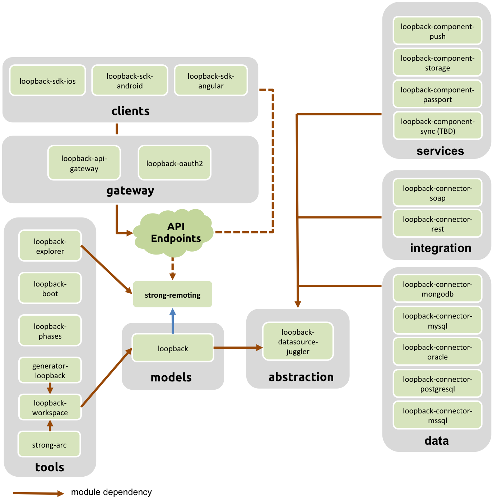

# loopback-docs-chinese

loopback 官网地址: <https://loopback.io>  
loopback 官网教程: <https://docs.strongloop.com/display/public/LB/LoopBack>  
loopback GITHUB: <https://github.com/strongloop/loopback>
部分中文的教程: <https://docs.strongloop.com/display/zh/LoopBack>

#### 目的

现在国内缺少 loopback 的中文文档,小生不才,偶遇loopback, 略懂英文 和 Google  
^\_^,欢迎交流与吐槽

### 简介

__Loopback 是一个高度可扩展的，开放源码的Node.js框架__  

- 通过很少编码实现端到端的REST API.
- 支持多种数据库: 如 Mongodb, MySql, 和支持 SOAP 和 REST API 的方式
- 建立模型关联,和对复杂的 api 有访问控制系统
- 拥有地理定位，文件，以及移动应用推送的服务
- 轻松创建 Android, iOS, JavaScript 端的 SDK
- 运行内部部署还是在云中的应用程序

### 参考地址和学习顺序

1. [LoopBack core concepts](https://docs.strongloop.com/display/LB/LoopBack+core+concepts):loopback的核心概念,了解loopback 如何使用.
2. [Getting started with LoopBack](https://docs.strongloop.com/display/LB/Getting+started+with+LoopBack): 跟着它会了解到loopback的一些关键特性.
3. [ LoopBack Developer Forum](https://groups.google.com/forum/#!forum/loopbackjs): 谷歌论坛

## LoopBack 框架
LoopBack 框架是由一组Node.js的模块构成的。你可以单独使用这些模块或把它们组合在一起使用。  
应用通过LoopBack model API可以使用以下三种方式访问数据。  
- 将模型作为一个标准的Node对象使用
- 通过HTTP REST API 调用
- 通过封装好的API SDK，包括iOS, Android 和 Angular

应用程序通过LoopBack model API用以上三种方式查询数据，储存数据，上传文件，发送email, 推送消息，注册/登陆用户等远程或本地的服务。用户也可以通过Strong Remoting将后端的API通过REST, WebSocket(或其他传输协议)供客户端调用。  
以下的图表展示了核心LoopBack模块，以及他们之间的关系。

## LoopBack 框架模块

| 模块类型  | 描述 | 用途  | 模块 |
| ------- |-----| -----| ----|
| 数据模型 | 数据模型和API服务 | 迅速创建动态的数据模型及API且无需关注数据是如何储存的。| loopback |
| 抽象方式 | 数据模型的抽象层，用与实现和不同数据库的交互 | 可以连接到不同的数据库或服务，并且提供一个对象用于CRUD，通过这个对象用户不必关心数据层具体使用的是什么数据库，可以是RDBS, MongoDB, Memory。|loopback-datasource-juggler |
|初始化 | 初始化应用 | 用于配置数据源, 定制/设置数据模型，并且将数据模型加载到指定的数据源上。同时可以配置应用本身和执行启动脚本。 | loopback-boot |
| 执行序列 | 执行Express中间件 | 设置中间件，使得这些中间件可以在应用程序的不同阶段被执行 | loopback-phase |
| 数据 | 连接RDBMS 和 noSQL 数据库 | 用于连接各种RDBMS和noSQL数据源的模块。| loopback-connector-mongodb    loopback-connector-mysql    loopback-connector-postgresql   loopback-connector-msssql   loopback-connector-oracle  |
| 集成 | 连接现有的企业或外部数据服务 | 用于连接到已有的REST或SOAP数据服务。| loopback-connector-rest   loopback-connector-soap |
| 服务 | 连接常用服务 | 整合已有的服务到Loopback应用中，包括推送消息，第三方验证等...... | loopback-component-push   loopback-component-storage   loopback-component-passport   loopback-component-sync   (开发中)|
| Gateway | API gateway(api 网关) | 保护您的API和注入的服务质量方面的调用和响应工作流程。 |  loopback-gateway   loopback-component-oauth2 |
| 客户端 | 客户端 SDK | 可以使用通过REST访问LoopBack API的原生平台组件 (iOS, Android, AngularJS) | loopback-sdk-ios   loopback-sdk-android   loopback-sdk-angular |
